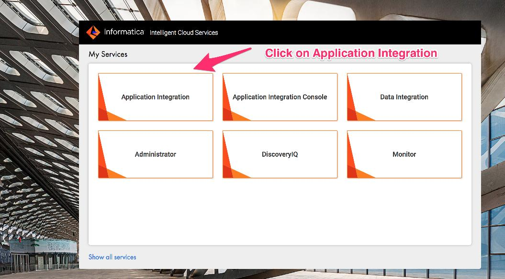

# API Design : Lab 1 - Create a Reverse Proxy to an Informatica Intelligent Cloud Workflow using Apigee Extensions

*Duration : 20 mins*

*Persona : API Team*

# Use case

You have a requirement to create a reverse proxy for taking requests from the Internet to retrieve lead information from a Salesforce CRM account and return the leads either as-is, or optionally further process them if required.

# How can Apigee Edge help?

Apigee Edge enables you to quickly expose backend services or workflows as APIs. You do this by creating an API proxy that provides a facade for the backend service or workflow that you want to expose.

The API proxy decouples your backend service implementation from the API that developers consume. This shields developers from future changes to your backend services. As you update backend services, developers, insulated from those changes, can continue to call the API uninterrupted.

In this lab, we will see how to create a reverse proxy, that routes inbound requests to an existing workflow running on Informatica Intelligent Cloud (IIC) that is exposed via an HTTP endpoint.

# Pre-requisites

* Admin credentials to the Informatica Integration Cloud - Application Integration
    * Please follow instructions documented in *Setting up you Informatica Cloud Organization* (../Setting up yout Informatica Cloud Organization/README.md)
* Salesforce Developer Account with ICRT package installed. (only needed for Lab 1)
    * See instructions in *Setting up you Informatica Cloud Organization* (../Setting up yout Informatica Cloud Organization/README.md)
* *FetchLeads* service workflow successully published to your IIC Cloud Org
* Apigee Edge account and Organization provisioned on Apigee Cloud with *Extensions* enabled
* Org Admin credentials to the above Apigee Edge Organization
* [REST Client](https://apigee-rest-client.appspot.com/) on a browser window., or Postman

# Instructions

## Review Informatica Integration Cloud - Application Integration - FetchLeads process workflow

**NOTE:** This workflow is pre-created in the IIC Application Integration demo environment. The process uses a Salesforce account to fetch lead objects from Salesforce and returns them in JSON format. Since this workflow should already have been configured as part of the Setup instuctions (See Pre-requisites above, this step is a review to make sure it is available for execution in IIC. 

1. Go to [https://dm-us.informaticacloud.com/identity-service/home](https://dm-us.informaticacloud.com/identity-service/home) and log in to the IIC UI.

2. Select **Application Integration** from the main page menu

3. Click on **Demo** project from the list of Application Integration projects displayed.

4. Click on the **Fetch Leads** process.

5. Review the *FetchLeads* process, to see that it iterates over all lead objects returned from SFDC and returns them in JSON format.

## Create and configure an Informatica Extension instance on Apigee Edge using the Edge UI

In the next set of steps below you will create an instance of the Informatica Extension, configure it, and deploy it to the Apigee Edge *Test* environment.

7. Login to the Apigee Edge Org as an Organization Administrator.

8. Select *Admin > Extensions* from the left navigation menu
This page displays the list of existing Extension instances previously created in your Org, if any. Click on the *Add Extension* button in the top right to create a new extension.

9. On the *New Extension* page, click *Informatica Integration Cloud* extension.
Enter a name and optional description for the Extension instance. Then, click Create.

10. On the Extension detail page, click the > to configure the instance for the corresponding Apigee environment. In this lab, we will configure the *leads* extension instance for the *test* environment.

11. Clicking the > will popup a dialog where you enter your IIC administrator username and password in JSON format. Please use your IIC cloud account login credentials. Then, click Save.

12. Once the configuration is saved, click on the Deploy button for the *test* environment. This will initiate deployment of the extension instance to the Apigee *test* environment.

13. Once the extension is successfully deployed, you should see a green check mark that says *Deployed*. This indicates that the extension is ready for use in an API proxy deployed to the same Apigee Edge environment.

*Congratulations!* ...You have now successfully configured and deployed an instance of the Informatica Extension on Apigee Edge.

## Develop an API in Apigee Edge using the Informatica Extension

In this set of steps, you will now develop an API in Apigee Edge that makes use of the Informatica Extension previously configured and deployed in the Edge *test* environment.

14. Click on Develop > API Proxies. This lists any existing API proxies in your Apigee Org. Click the *+Proxy* button in the top right to create a new API proxy.

15. Select the *No Target* option and click Next. On the Proxy Details page provide the following information:
*NOTE*: Replace the {your_initials} with your own initials. 

*Proxy name*: {your_initials}_leads
*Proxy basepath*: Append a version to the default basepath: /{your_initials}_leads/v1
*Description*: Optionally, enter a description for the proxy

16. Click thru the next set of pages to deploy the proxy
Click Next. 
On the next page select the *Passthru* option to allow the proxy to be called with no authorization. 

Click Next. Accept the default virtual hosts selected. This will deploy the proxy to both the default and secure virtual hosts on Apigee Edge. 

Click Next. Uncheck the *prod* environment checkbox and leave the *test* checkbox checked. This will deploy the API proxy only to the test environment. Finally click *Build and Deploy* to deploy the proxy.

17. Once the API proxy is successfully deployed, click the link to view it in the development editor in the Edge UI. From the Overview page, click the *Develop* tab at the top right. 

18. Next, Click the + button to add a new 'GET' conditional flow to the proxy.
Enter the Flow name, description, select *Path and Verb* option, enter values for Path (=/), and Verb (=GET), then click the *Add* button.

19. Add the Extension Callout policy to the GET leads condition flow. In the policy popup, select the *sfLeadsExtension* instance previously created, then select the *FetchLeads* Action from the drop-down list. Apigee Edge automatically discovers all available workflows for this extension instance.

20. Edit the policy to change the name of the output variable. This variable will contain the output of the extension that will return a list of Salesforce leads in JSON format. Click Save to save and deploy the proxy.

21. Set the contents of the output variable as the response of the API proxy. To do this, add an *AssignMessage* policy to the response of the GET leads conditional flow. Click on +Step button in the response flow, then select *AssignMessage* policy type in the popup dialog.

22. Edit the *AssignMessage* policy to remove the unused elements, set the payload content type, and content to come from the *sfleads* variable, and set the *AssignTo* elements' type attribute to be *response*, as shown in the image below. Then, click Save to save and deploy the proxy changes.

*Congratulations!* ...You have now built a reverse proxy for an existing backend service running on Informatica Integration Cloud.

## Test the API Proxy

1. Let us test the newly built API proxy. This proxy is a *passthru* proxy since it does not have any Apigee policies configured yet. We will add policies in subsequent labs. 
We will use the [REST Client](https://apigee-rest-client.appspot.com/). Open the REST Client on a new browser window.  You can also use other REST clients (eg. Postman) for testing.

2. Click on the *Trace* tab in the top right of the Developer editor in the Edge UI.

3. Copy the URL for your API proxy from the *Send Requests* section in the Apigee Edge UI. Click on the green *Start Trace Session* to start a trace session for your proxy.

4. Paste the link into the REST Client to make a GET call, and observe the request/response in the Trace window of the Apigee Edge UI.

5. You should see a success response similar to this -

# Summary

That completes this hands-on lesson. In this simple lab you learned how to create and deploy a passthru API proxy on Apigee Edge for an existing backend process from Informatica Integration CLoud.

# References

* Informatica Integration Cloud Extension (https://docs.apigee.com/api-platform/reference/extensions/informatica-integration-extension)

