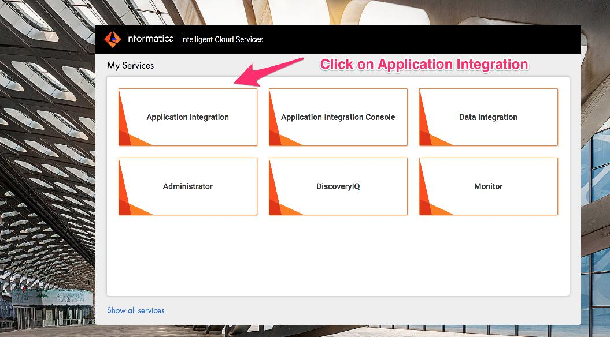
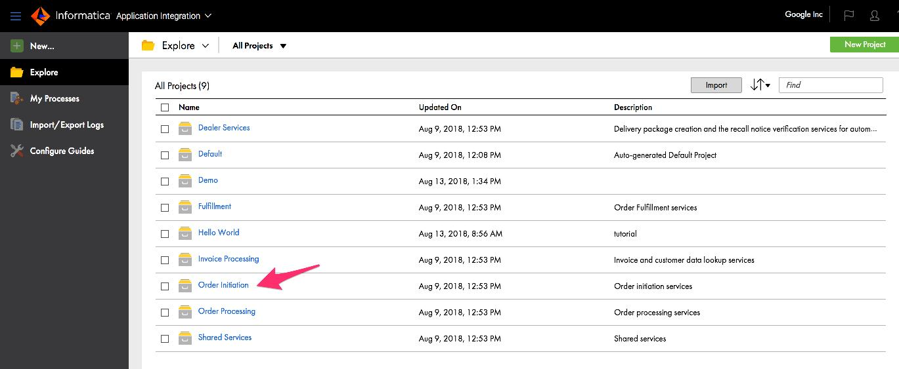
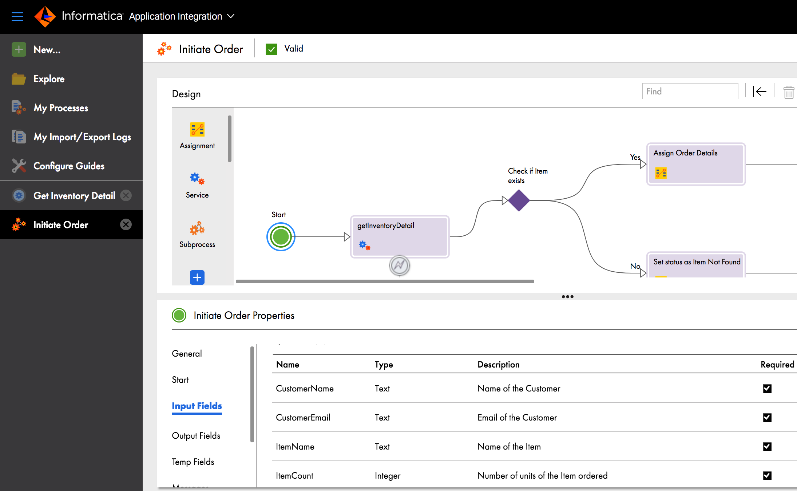
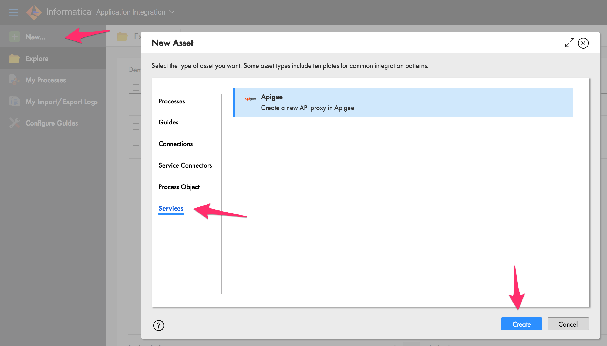
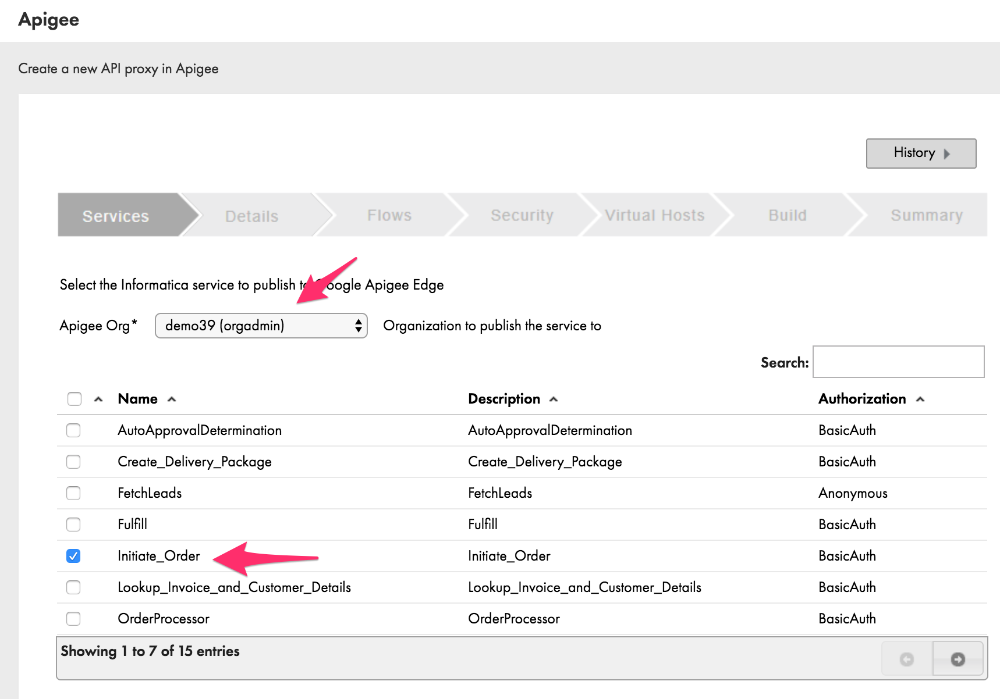
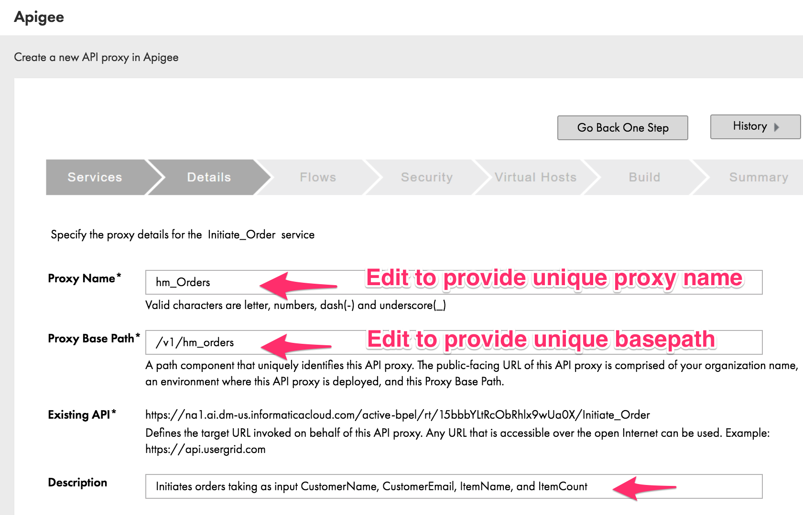
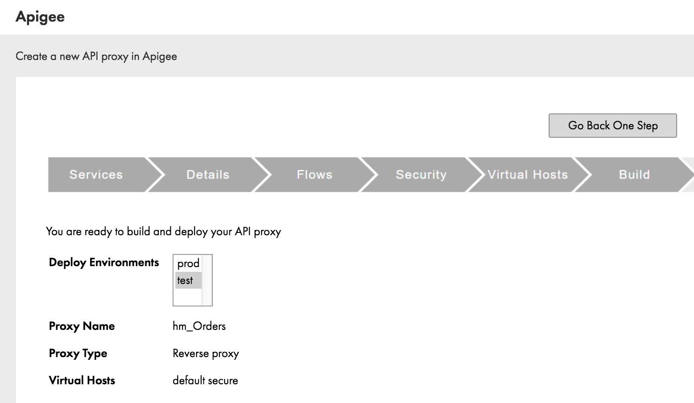
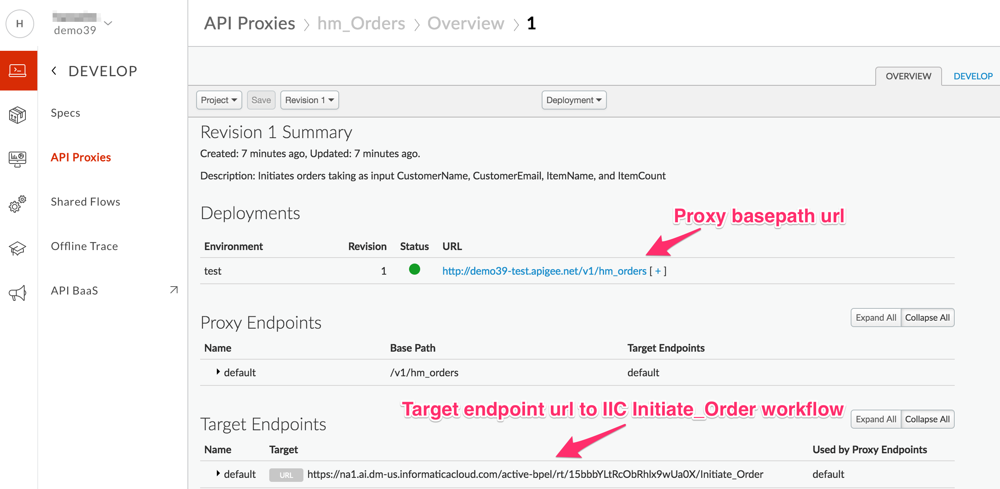
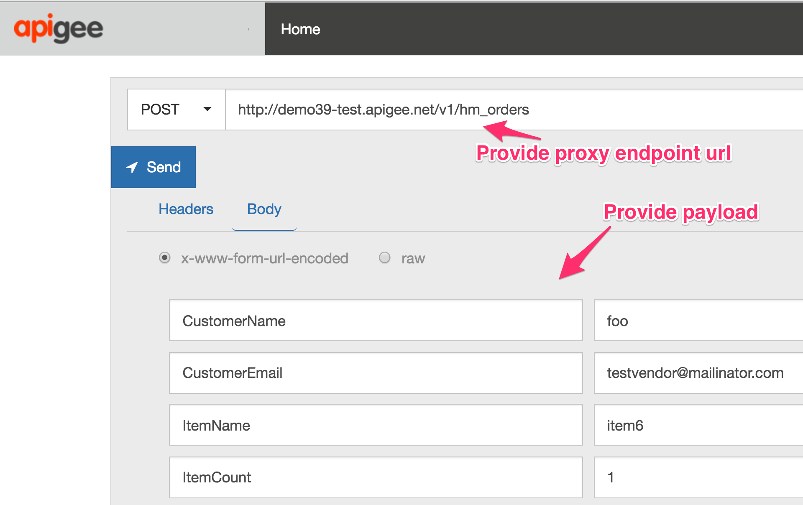
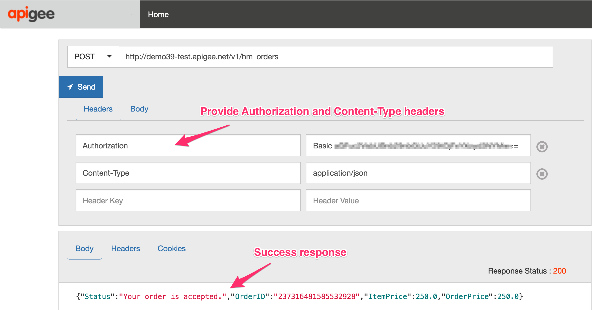

# API Design : Lab 2 - Create a Reverse Proxy to an IIC Workflow as the target

*Duration : 20 mins*

*Persona : Informatica Architect*

# Use case

You have a requirement to create a reverse proxy for taking requests from the Internet and forward them to an existing *Order to Cash* service running on the Informatica Intelligent Cloud (IIC), inorder to make the order initiation process easily consumable using a REST API. You would like to generate an Apigee API Proxy by using the IIC Application Integration tool instead of building the API Proxy from scratch.

# How can Apigee Edge help?

Apigee Edge enables you to quickly expose backend services or workflows as APIs. You do this by creating an API proxy that provides a facade for the backend service or workflow that you want to expose.

The API proxy decouples your backend service implementation from the API that developers consume. This shields developers from future changes to your backend services. As you update backend services, developers, insulated from those changes, can continue to call the API uninterrupted.

In this lab, we will see how to create a reverse proxy, that routes inbound requests to an existing workflow running on IIC that is exposed via a target HTTP endpoint.

# Pre-requisites

* Complete the steps outlined in *Setting up your Informatica Cloud Organization*
* Login access to the Informatica Integration Cloud - Application Integration console.
* *Order Initiation* service workflow successully published to your IIC Cloud Org
* Apigee Edge account and Organization provisioned on Apigee Cloud
* [REST Client](https://apigee-rest-client.appspot.com/) on a browser window., or Postman

# Instructions

## Review Informatica Integration Cloud - Application Integration - Order Initiation process workflow

**NOTE:** This workflow is pre-created in the IIC Application Integration demo environment. Since this workflow is already pre-configured, this step is a review to make sure it is available for execution in IIC. 

**NOTE:** This workflow is secured using BasicAuth credentials which must be passed in as an Authorization header on the request. The credentials are the same as that used to log into the IIC console.

1. Go to [https://dm-us.informaticacloud.com/identity-service/home](https://dm-us.informaticacloud.com/identity-service/home) and log in to the IIC UI using your IIC credentials.

2. Select **Application Integration** from the main page menu

3. Click on **Order Initiation** project from the list of Application Integration projects displayed. 

4. Click on the *Initiate Order* process to review the steps in the workflow. 

Click on the *Input Fields* in the lower pane to view the *Initiate Order properties*.

*Note*: In this workflow, you need to pass in 4 required parameters in the POST payload of the request. These are the *CustomerName, CustomerEmail, ItemName, ItemCount*.

Click on the *Output Fields* element to view the list of fields returned in this workkflows' response. These are *Status, OrderID, ItemPrice, OrderPrice fields*.

Click on other objects in the servic workflow to review. You do not need to make any changes to this workflow for this Lab. 

## Create an API Proxy on Apigee Edge from IIC Application Integration

In the next set of steps below you go through a wizard in the IIC UI to create and deploy an API proxy on Apigee Edge. The wizard screens follow a similar set of steps, as the Apigee proxy creating wizard that you use when deploying an API proxy using the Apigee Edge Management UI.

5. Next, click on the *New* button at the top left and select *Services* from the nav menu. This allows you to create a new Apigee service. Click on the *Create* button.

6. This launches a proxy creation wizard within the IIC console. Select the Apigee Edge Organization to which you want the API proxy to be deployed to. Check the *Initiate_Order* service, and click *Next*.

7. Provide information about the proxy on this page. Enter a unique proxy name eg.{your_initials}_Orders, and provide a unique proxy basepath. eg. /v1/{your_initials}_orders. Optionally, update the description field, then click *Next*.

8. The *Initiate_Order* service only supports a single *Initiate_OrderOperation*, so check the box to include a conditional flow for this operation in the generated API proxy. Click *Next*.

9. On the next page use *Authorization* passthru, leave checkboxes unchecked, and click *Next*.

10. On the *Virtual Hosts* page, select both the *default*, *secure* virtual hosts. This indicates which virtual host the API proxy is deployed to, and receive traffic at at the appropriate endpoint (based on the environment). Click Next.

11. On the final *Build* page, review the proxy settings. Select only the *test* environment from the list. This wil build and deploy the API proxy to Apigee Edge *test* environment within the Apigee Organization you provided. Click Next. 
*NOTE*: Clicking Next here will deploy the API proxy to Apigee Edge. If you need to change any of the settings, click the *Go Back One Step* button to go to the previous page in the wizard.

12. Once the proxy is deployed successfully, you should see a *Summary* page, saying that the API proxy has been built and deployed to Apigee Edge. 
Click on the link to view the proxy in Apigee Edge. You will be taken to the Apigee Edge UI where you will have to login using your Apigee Edge credentials, select the Org and view the deployed proxy.

13. Click the *Develop* tab in the top right. A *Conditional Flow* has been added to the generated proxy for the POST orders operation.

*Congratulations!* ...You have now built a reverse proxy for an existing backend service running on Informatica Integration Cloud.

## Test the API Proxy

1. Let us test the newly built API proxy. This proxy is a *passthru* proxy since it does not have any Apigee policies configured yet. We will add policies in subsequent labs. 
We will use the [REST Client](https://apigee-rest-client.appspot.com/). Open the REST Client on a new browser window or tab.  You can also use other REST clients (eg. Postman) for testing.

2. Click on the *Trace* tab in the Apigee Edge UI, and click the green *Start Trace Session* button to start a trace session for this API proxy.

3. Copy the URL for your API proxy from the *Send Requests* pane in the Apigee Edge UI.

4. Paste the link into the REST Client to make a POST call. 
As part of the request, you will need to supply the following information:

Header:
*Authorization: Basic <b64 of your IIC account credentials>*
*Content-Type: application/json*

Payload Body:

Click on *Send*.

4. You should see a success response similar to this -

# Summary

That completes this hands-on lesson. In this simple lab you learned how to create and deploy a passthru API proxy on Apigee Edge for an existing backend process from Informatica Integration CLoud.

# References

TBD

