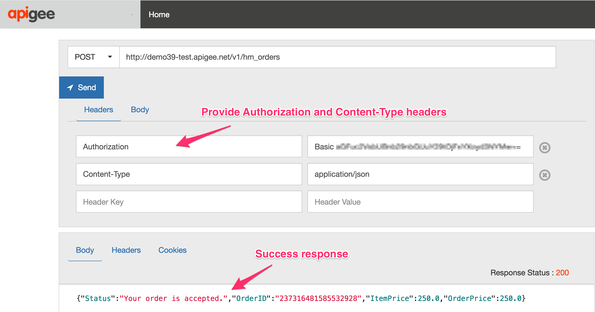

# API Design : Lab 3 - Secure the API Proxy to the IIC Workflow

*Duration : 20 mins*

*Persona : API Team*

# Use case

In this lab, we will build on the API proxy that was created in Lab 2.

In this Lab we will secure calls to the proxy via an API key. In the previous Lab 2, you had to pass in the IIC Org credentials which were passed thru to the IIC backend target. Since these are backend credentials, we will need to modify the proxy to implement to enhancements:

* Implement API key verification so that calling apps will need to pass in a valid apikey (instead of the IIC credentials)
* Retrieve the IIC credentials from a Key-Value map at runtime, and pass those credentials to the backend IIC target

# How can Apigee Edge help?

Apigee Edge enables you to quickly expose backend services or workflows as APIs. You do this by creating an API proxy that provides a facade for the backend service or workflow that you want to expose.

The API proxy decouples your backend service implementation from the API that developers consume. This shields developers from future changes to your backend services. As you update backend services, developers, insulated from those changes, can continue to call the API uninterrupted.

In this lab, we will see how to secure calls to a reverse proxy, retrieve and pass backend-specific credentials to the target backend, create an API Product for our proxy, register an application to the product, and generate an API key for the application so it can supply it in the call to our proxy.

# Pre-requisites

* Complete the steps outlined in *Setting up your Informatica Cloud Organization*
* Login access to the Informatica Integration Cloud - Application Integration console with Order Management workflows provisioned.
* Apigee Edge account and Organization provisioned on Apigee Cloud
* [REST Client](https://apigee-rest-client.appspot.com/) on a browser window., or Postman
* Deployed *Orders* proxy (from Lab 2) in your Apigee Edge Org.

# Instructions

## Part I. API Proxy secures call to the IIC backend.

## Create a Key-Value Map to store IIC credentials in Apigee Edge

We will first create an encrypted KVM to store the IIC Org credentials. These credentials are needed by the IIC backend to be supplied as a BasicAuth header in the request to the Initiate_Order service workflow.

1. Login to Apigee Edge at https://login.apigee.com using your Apigee Edge credentials.

2. Once logged in, switch to the Organization that contains the *Orders* proxy. See Pre-requisites section above.

3. Using the left navigation menu, click on Admin > Environments. On the Environments page, select the *Test* environment from the drop-down list, and click on the *Key Value Maps* tab. Click on the *+Key Value Map* button to create a new KVM.

4. In the popup dialog, provide a name for the Key Value Map, and check the *Encrypted* box. Click the *Add* button. Once created, the KVM should show in the list of KVMs on this page.

5. Click the arrow next to the KVM to expand and add two entries to this map. The 2 entries are:
* key: iic_username, value: _your_IIC_login_username
* key: iic_password, value: _your_IIC_login_password

## Modify the API proxy to authenticate against the IIC Target backend

6. Now, navigate to the Develop > API Proxies section in the Apigee Edge UI. Select the *Orders* proxy, and click on the *Develop* tab to edit the proxy. 
* Select the Target Endpoints > default > PostFlow in the Navigator. 
* Click +Step button in the graphical editor on the Request flow
* Select the *Key Value Map Operations* policy
* Click Add

7. Edit the KVM policy in the XML editor to provide the *mapIdentifier* (name of the map that was created in Step 3), as well as the GET entries for the iic_username, and iic_password. Then, click *Save* to save the proxy.

8. Next, in the same Target Endpoint > default > Postflow add the Basic Authentication policy. This policy will add an Authorization header to the request with the value generated from the usernmae/password fields supplied to it at runtime.
* Select the Target Endpoints > default > PostFlow in the Navigator. 
* Click +Step button in the graphical editor on the Request flow
* Select the *Basic Authentication* policy
* Click Add

9. Edit the BasicAuth policy in the XML editor to provide the source of the username/password fields. Then, click *Save* to save the proxy.

## Test the API Proxy

1. Let us test the updated API proxy.
We will use the [REST Client](https://apigee-rest-client.appspot.com/). Open the REST Client on a new browser window or tab.  You can also use other REST clients (eg. Postman) for testing.

2. Click on the *Trace* tab in the Apigee Edge UI, and click the green *Start Trace Session* button to start a trace session for this API proxy.

3. Copy the URL for your API proxy from the *Send Requests* pane in the Apigee Edge UI.

4. Paste the link into the REST Client to make a POST call. 
As part of the request, you will need to supply the following information:
*NOTE*: You no longer need to pass the IIC backend credentials to the proxy, since the proxy is using stored credentials and adding the basic auth header to the request at runtime.

Header:
*Content-Type: application/json*

Payload Body:

Click on *Send*.

4. You should see a success response similar to this -

## Part II. Secure calls to the API proxy using an API key

In this part of the lab, we will secure access to our *Orders* API, by requiring calling applications to supply a valid apikey in the request. Apigee Edge support API key provisioning by associating API Products to developer applications, as well as key validation and enforcement via the VerifyApiKey policy. 

1. In this Step we will enforce all requests to the *Orders* api to pass in a valid apikey in the request header. To implement that in the proxy, go to 
* Develop > API Proxies and select the *Orders* api. 
* Click on the *Develop* tab, and select the Proxy Endpoints > default > PreFlow in the UI.
* Click the *+Step* button and select the *Verify API Key* policy in the dialog
* Click *Add* to add the policy to the *PreFlow*

* Edit the policy in the XML editor to look for the apikey in the request header, instead of the request query parameter. Then click *Save* to save and deploy the proxy.

3. Once the proxy verifies the apikey, it is a best practice to remove it from the request to prevent the key to be leaked to the backend target. To do this:
* Add an *AssignMessage* policy in the proxy *PreFlow* after the Verify API Key policy
* Edit the policy to clean out unused elements, and use the *Remove* tag to remove the apikey from the request header
* Save and deploy the API proxy.

2. Follow the steps outline in this [Lab](https://github.com/apigeekdemos/apijam/tree/informatica/Labs/Core/Lab%204%20API%20Security%20-%20Securing%20APIs%20with%20API%20Keys) to publish an *Orders* API Product, register a developer and application, and generate an apikey for the app. You will use this key to pass in the request header to test the proxy.

* When configuring the API Product select the *Orders* proxy to be included in the product:

* When creating the App in the Edge UI, register it to use the *Orders* API Product.
* Click *Save* to save the app.

* View the app in the Edge UI to retrieve the apikey generated for the app.

## Test the API Proxy

1. Let us test the updated API proxy using the [REST Client](https://apigee-rest-client.appspot.com/).

2. Click on the *Trace* tab in the Apigee Edge UI, and click the green *Start Trace Session* button to start a trace session for this API proxy.

3. Copy the URL for your API proxy from the *Send Requests* pane in the Apigee Edge UI.

4. Paste the link into the REST Client to make a POST call. 
As part of the request, you will now need to supply the following information:

Header:
*apikey*: <Your-application-apikey>
*Content-Type: application/json*

Payload Body:

Click on *Send*.

4. You should see a success response similar to this -

# Summary

That completes this hands-on lesson. In this simple lab you learned how to create and deploy an API proxy on Apigee Edge for an existing backend process from Informatica Integration CLoud.
* You secured access to the API using an apikey
* You secured the backend IIC target call using credentials retrieved from a secured storage location on Apigee Edge.

# References

TBD

