# API Design : Create a Reverse Proxy to an IIC Workflow

*Duration : 20 mins*

*Persona : API Team*

# Use case

You have a requirement to create a reverse proxy for taking requests from the Internet and forward them to an existing service running on the Informatica Intelligent Cloud (IIC). You would like to generate an Apigee API Proxy by using the IIC Application Integration tool instead of building the API Proxy from scratch.

# How can Apigee Edge help?

Apigee Edge enables you to quickly expose backend services or workflows as APIs. You do this by creating an API proxy that provides a facade for the backend service or workflow that you want to expose.

The API proxy decouples your backend service implementation from the API that developers consume. This shields developers from future changes to your backend services. As you update backend services, developers, insulated from those changes, can continue to call the API uninterrupted.

In this lab, we will see how to create a reverse proxy, that routes inbound requests to an existing workflow running on IIC that is exposed via an HTTP endpoint.

# Pre-requisites

* Login access to the Informatica Integration Cloud - Application Integration console with Order Management workflows provisioned.
    * Please get IIC login credentials from Instructor.
* Apigee Edge account and Organization provisioned on Apigee Cloud
* [REST Client](https://apigee-rest-client.appspot.com/) on a browser window., or Postman

# Instructions

## Review Informatica Integration Cloud - Application Integration - Initiate Order process workflow

**NOTE:** This workflow is pre-created in the IIC Application Integration demo environment. It is part of a standard Order-to-Cash business workflow that implements checking of Inventory for the item being purchased, assigning order details, sending email etc. Since this workflow is already pre-configured, this step is a review to make sure it is available for execution in IIC. 

1. Go to [https://dm-us.informaticacloud.com/identity-service/home](https://dm-us.informaticacloud.com/identity-service/home) and log in to the IIC UI using your IIC credentials.

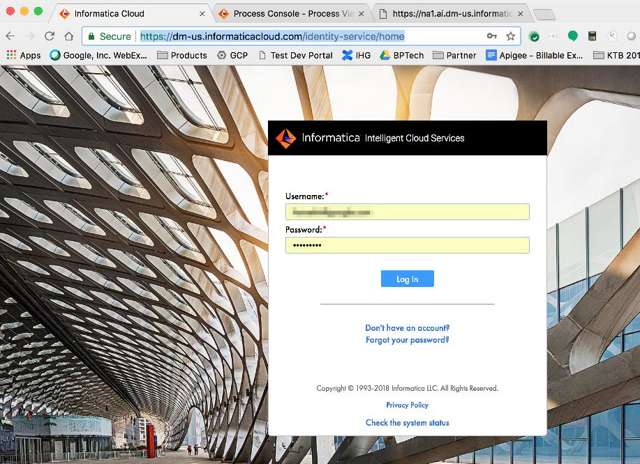

2. Select **Application Integration** from the main page menu

3. Click on **Order Initiation** project from the list of Application Integration projects displayed.

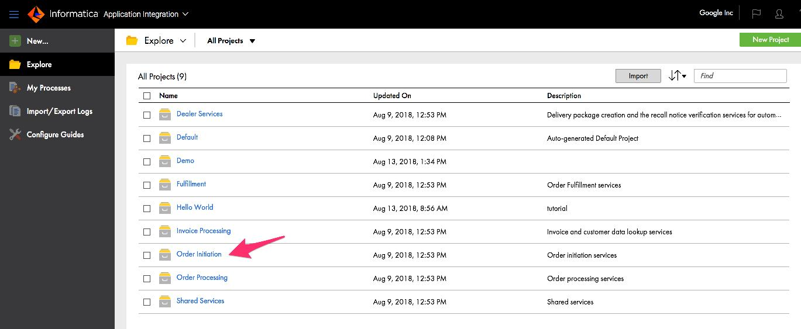

4. Click on the **Initiate Order** process.

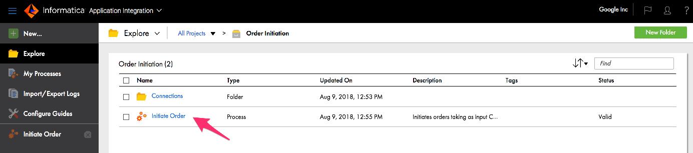

5. Review the Initiate Order process, Input and Output fields. You can see what fields are needed by the workflow as input, by clicking on the *Input Fields* tab in the left pane, as well as the *Output Fields* tab for the output of the workflow process.

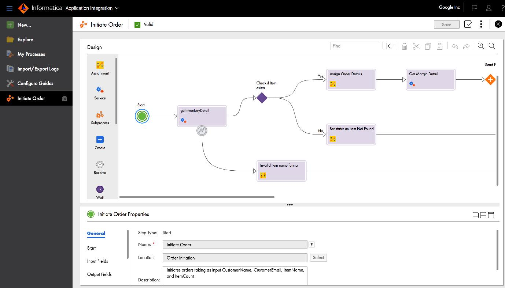

6. Click on *New* Asset tab from the left pane and Select *Services*. You should see Apigee as one of the service types in the dialog. Click on the *Create* button to go through the Apigee proxy creation wizard.

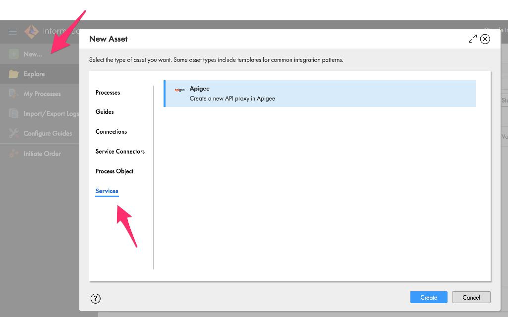

## Create an API Proxy on Apigee Edge from IIC Application Integration

In the next set of steps below you go through a wizard in the IIC UI to create and deploy an API proxy on Apigee Edge. The wizard screens follow the same functionality as the Apigee proxy creating wizard that you use when deploying an API proxy using the Apigee Edge Management UI.

7. Provide the *Apigee Edge Org Name* (pre-requisite) in the box and select the *Initiate Order* process, and click Next.

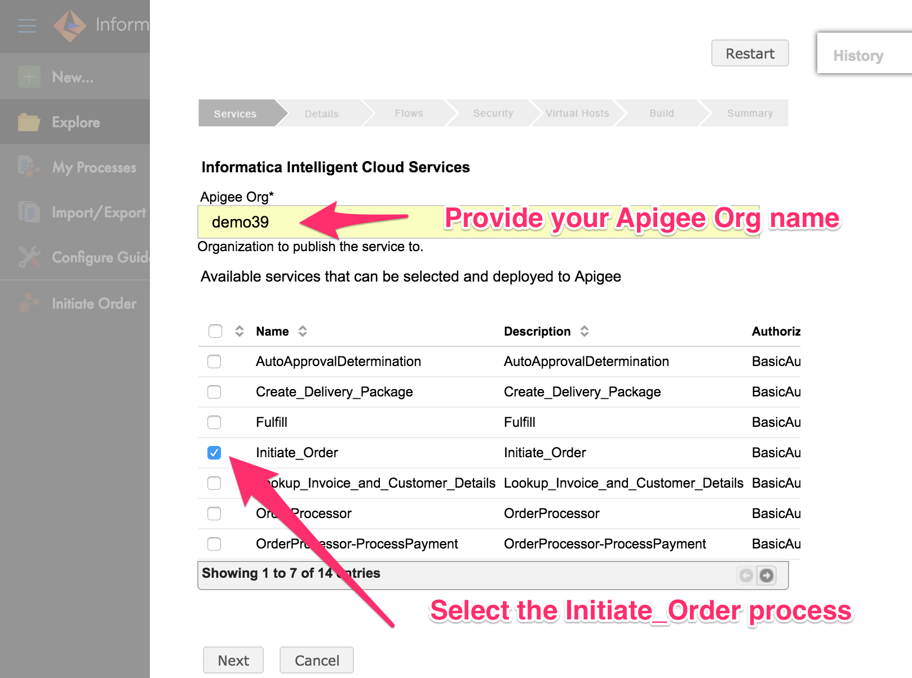

8. On the *Details* page, accept the defaults or if you want change the fields with appropriate values. Click Next.
*NOTE* If you have gone through this wizard before for the same process, make sure to update the proxy name and basepath.

9. On the *Flows* page, select *Initiate_Order operation*, and click Next.
*NOTE* Depending on the process you pick in the previous screens, there may be 1 or more operations displayed in this screen. You can pick or choose all operations depending on which flows you need to support within the API proxy.

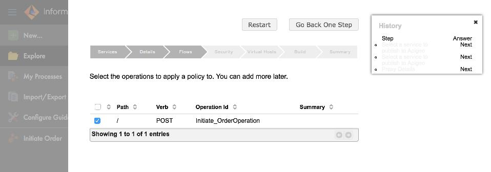

10. On the *Security* page select *Publish API Product*, leaving other checkboxes unchecked. This will create an API product for our proxy for use in subsequent labs.

11. On the *Virtual Hosts* page, select both the *default*, *secure* virtual hosts. This indicates which virtual host the API proxy is deployed to, and receive traffic at at the appropriate endpoint (based on the environment). Click Next.

12. On the final *Build* page, review the proxy settings. Select the *test* environment from the list. This wil build and deploy the API proxy to Apigee Edge *test* environment within the Apigee Organization you provided. Click Next.

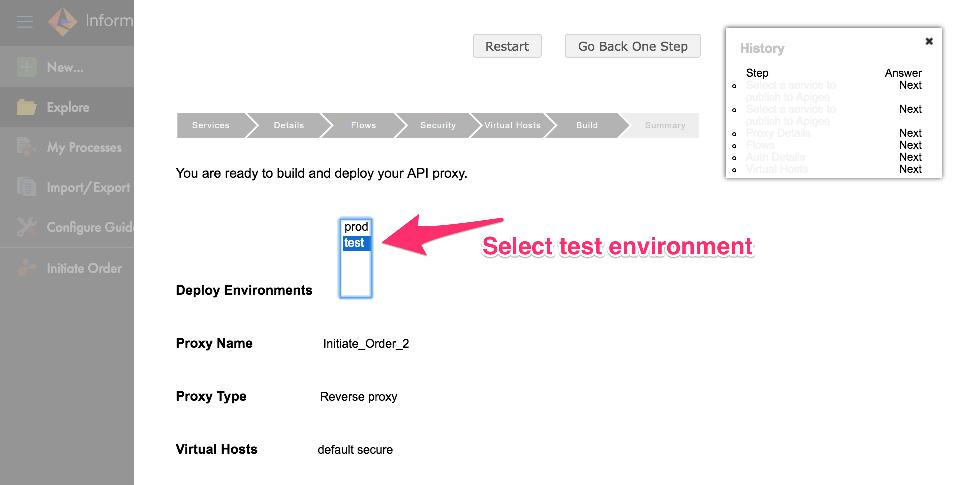

13. On success, you should see a *Summary* page, saying that the API proxy has been built and deployed to Apigee Edge.

14. Click on the link to view the proxy in Apigee Edge. You will be taken to the Apigee Edge site where you will have to login using your Apigee Edge credentials, select the Org and view the deployed proxy.

*Congratulations!* ...You have now built a reverse proxy for an existing backend service running on Informatica Integration Cloud. You should see the proxy **Overview** screen.

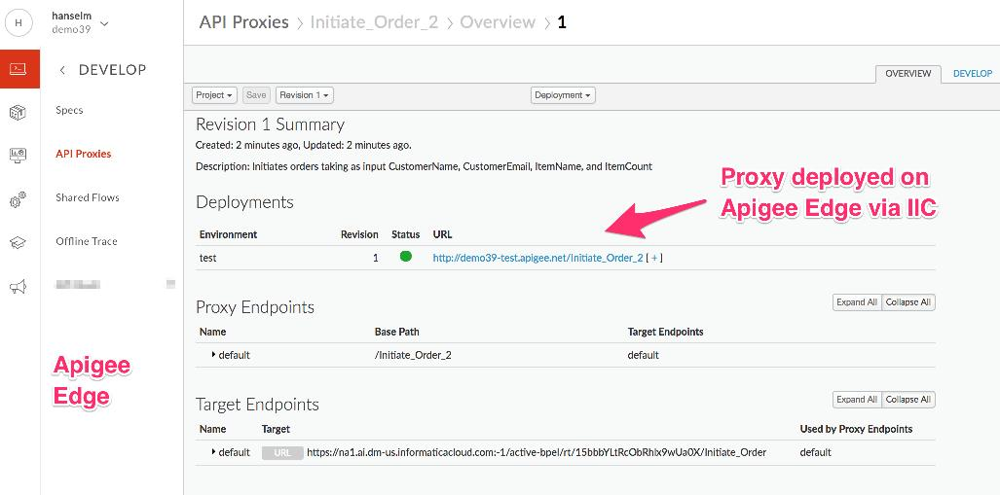

## Test the API Proxy

1. Let us test the newly built API proxy. This proxy is a *passthru* proxy since it does not have any Apigee policies configured yet. We will add policies in subsequent labs. 
We will use the [REST Client](https://apigee-rest-client.appspot.com/). Open the REST Client on a new browser window.  You can also use other REST clients (eg. Postman) for testing.

2. Copy the URL for your API proxy from the summary page in the Apigee Edge UI. (See above screenshot)

3. Paste the link into the REST Client to make a POST call:
As part of the request, you will need to supply the following information:

Header:
*Authorization: Basic <b64 of your IIC account credentials>*
Payload Body:
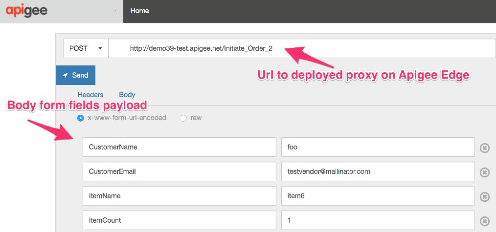

Click on *Send*.

4. You should see a success response similar to this -
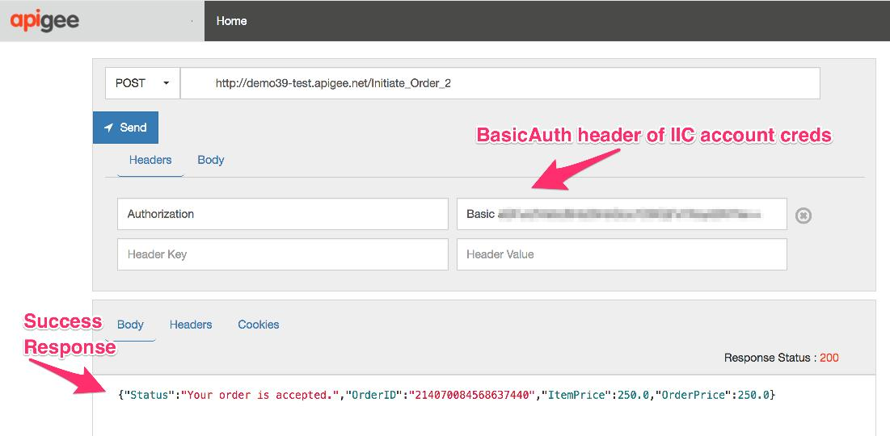

# Summary

That completes this hands-on lesson. In this simple lab you learned how to create and deploy a passthru API proxy on Apigee Edge for an existing backend process from Informatica Integration CLoud.

# References

* Useful Apigee documentation links on API Proxies - 

Now go to [Lab-2](https://github.com/apigee/devjam3/tree/master/Labs/Core/Lab%202%20Traffic%20Management%20-%20Throttle%20APIs)

