# Setting up your Informatica Cloud Organization

*Duration : 40 mins*

*Persona : API Team*

The set of steps below allows you to configure your own Informatica Cloud organization.

# Pre-requisites

* Admin credentials to the Informatica Integration Cloud - Application Integration
    * You can sign up for your own free trial account here: (https://www.informatica.com/trials/apigee.html#fbid=kCfMfR9hzHc)
    * Once registered, confirm your account by clicking on the link in the email you receive at the registered email address.
    * Enter password, security question, and click the *Log In* button. (*Note*: The log in button might be grayed out in the UI, but click anywhere in the box and it should get enabled)
    * Click *Continue* on the privacy dialog.

* Salesforce account with credentials : username, password, security token. This is only needed for the FetchLeads IIC workflow. If you do not have a Salesforce account, you can sign up for one here: (https://developer.salesforce.com/signup?d=70130000000td6N).
    * Click the link in the verification email to activate your account.
    * Enter a password and security question/answer
    * Once logged into Salesforce, click the Setup (gear icon) on the top right to install the ICRT package
        * In a separate browser tab navigate to the url:
        https://login.salesforce.com/packaging/installPackage.apexp?p0=04to0000000KEBS
        * On the page, select the *Install for all Users*, check the acknowledgement, and click *Install*
        NOTE: On oaccasion, you may see a page saying that *This app is taking a long time to install*. You should receive an email once the installation is completed.
        * Verify the package in installed by going to *Apps > Installed Packages* in the left nav of the Salesforce UI.

* Apigee Edge account and Organization provisioned on Apigee Cloud
    * You can sign up for your own free trial account here: (https://apigee.com/api-management/#/homepage)
* Org Admin credentials to the above Apigee Edge Organization
* [REST Client](https://apigee-rest-client.appspot.com/) on a browser window., or Postman

# Instructions

## Configure IIC Org with Apigee Edge Connection

The steps below shows how to configure your IIC Org with the configuration needed to push API proxies to your Apigee Edge Organization.

1. Go to [https://dm-us.informaticacloud.com/identity-service/home](https://dm-us.informaticacloud.com/identity-service/home) and log in to the IIC UI using your IIC Trial Org credentials.

2. Select **Application Integration** from the main page menu

3. Click on **Default** project from the list of Application Integration projects displayed.

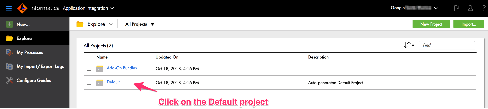

4. Click on the *New* button at the top left to add a new connection. Select *Connections* from the left nav in the dialog, and click the *Create* button.

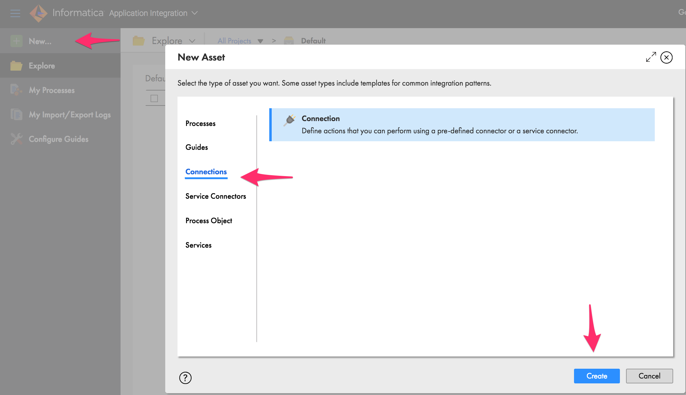

5. Configure the Apigee Edge connection to provide the following information:
* Provide a name for the connection *GoogleApigeeEdgeConnection* (as-is)
* Use the *Google Apigee Edge Integration* connection type from the Type dropdown
* Select *Run on Cloud Server or any Secure Agent*
* Provide your Apigee Edge Org Admin credentials (username/password) in the edit fields
* Leave the *Edge Identity Zone* field blank
* Click the *Save* button at top right
* Once saved, click the 3 dots on the right, and select *Publish* to publish the connection

## Import the InitiateOrder IIC Service Workflow

6. In the steps below, you will import the *InitiateOrder* service workflow into your Trial IIC Org.

* Go to apijam/Labs/Informatica/Resources on github.com and download the *Order_Initiation.zip* file
* In *Application Integration*, click on the *Explore* folder icon in the left nav
* Click on the green *Import* button at the top right
* In the file dialog, click *Choose File*, and select the *Order_Initiation.zip* file
* Click on the green Import button to start the import of this workflow alongwith all its dependencies

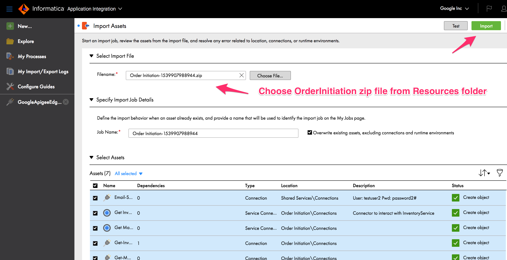

 Once the Import is completed, you should see 2 additional projects created with the dependent objects

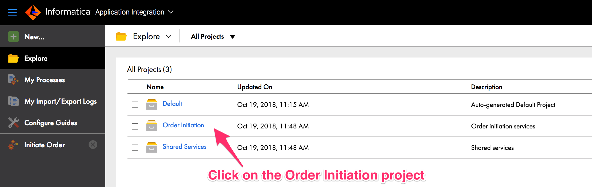

7. Publish the Service Connectors and Connections in the *Shared Services* project
* For the Email Service service connector, provide the password (GET from Instructor) and click Save, then Publish. Click the 3 dots to the right of the connector and click *Publish*
* Repeat the same for the Email-Service connection
* Finally Publish the *Send Email* process

8. Publish the Service Connectors and Connections in the *Order Initiation* project
* Click on *Order Initiation* project
* Click on *Connections* folder
* Publish the *Get Inventory Detail* Service Connector. Click the 3 dots to the right of the connector and click *Publish*
* In order to Publish the *Get Margin Detail* Service Connector, provide the password (GET from Instructor), and Save, then click Publish
* Next, Publish the *Get-Inventory-Detail connection
* In order to Publish the *Get-Margin-Detail connection, provide the password (GET from Instructor) to the connection, then click Publish

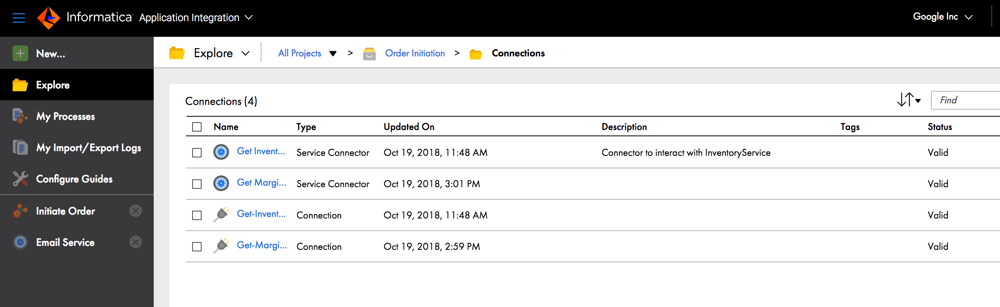

9. Edit the *Start* properties of the *Initiate Order* workflow to add your username to the *Allowed Users* field. Then, click *Save*, then *Publish* the workflow.

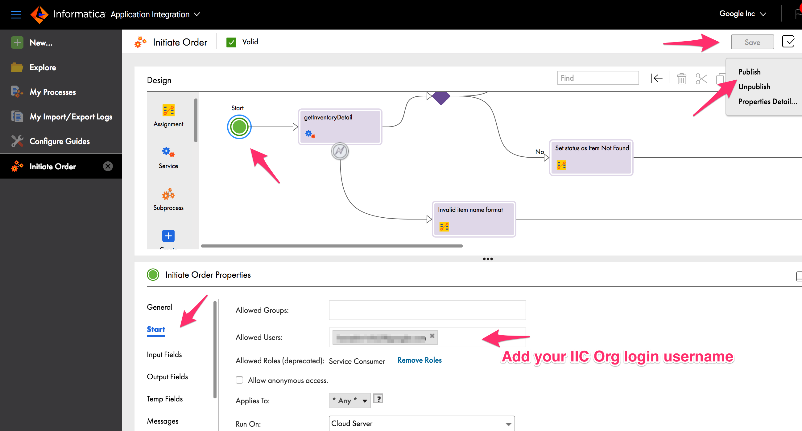

## Import the FetchLeads IIC Service Workflow

10. We will also import the *FetchLeads* service workflow into your Trial IIC Org.

* Go to apijam/Labs/Informatica/Resources on github.com and download the *Fetch_Leads.zip* file
* In *Application Integration*, click on the *Explore* folder icon in the left nav
* Click on the green *Import* button at the top right
* In the file dialog, click *Choose File*, and select the *Fetch_Leads.zip* file
* Click on the green Import button to start the import of this workflow alongwith all its dependencies

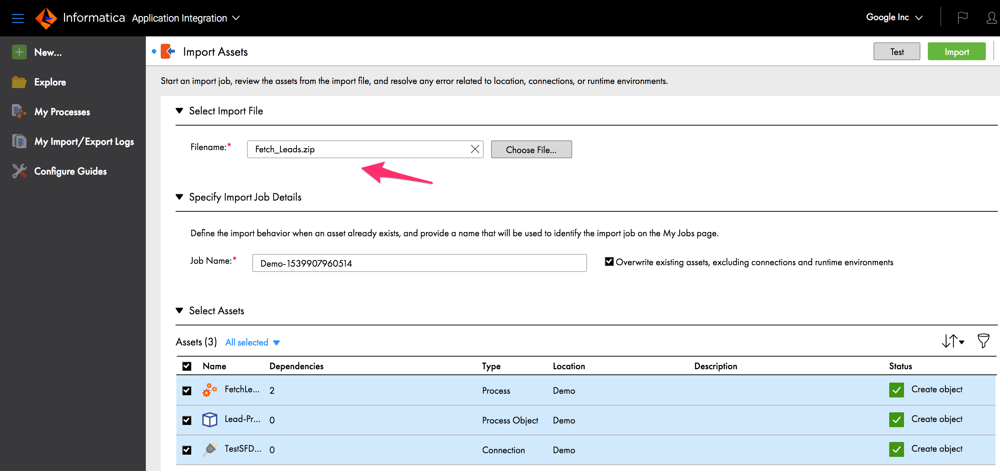

 Once the Import is completed, you should see a *Demo* project created with the *FetchLeads* process and dependent objects

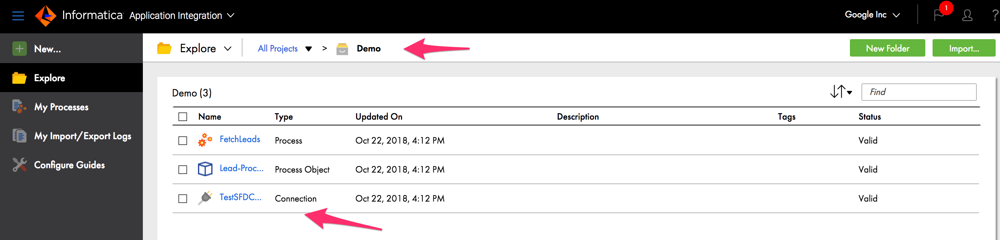

11. Edit and Publish the *TestSFDCConnection* in the *Demo* project
* Click on *Demo* project
* Click on *TestSFDCConnection* folder
* Provide your SFDC connection credentials: username, password, security token
    * In order to get your security token, once you login to Salesforce, go to your profile icon at the top right, then click *Settings*. Under *My Personal Information* in the left nav menu, select *Reset My Security Token*.
* Click *Save*
* Test the connection is working properly by clicking the *Test* button. You should see a *Passed* string displayed, if the connection to Salesforce is successful.
* Finally, *Publish* the connection

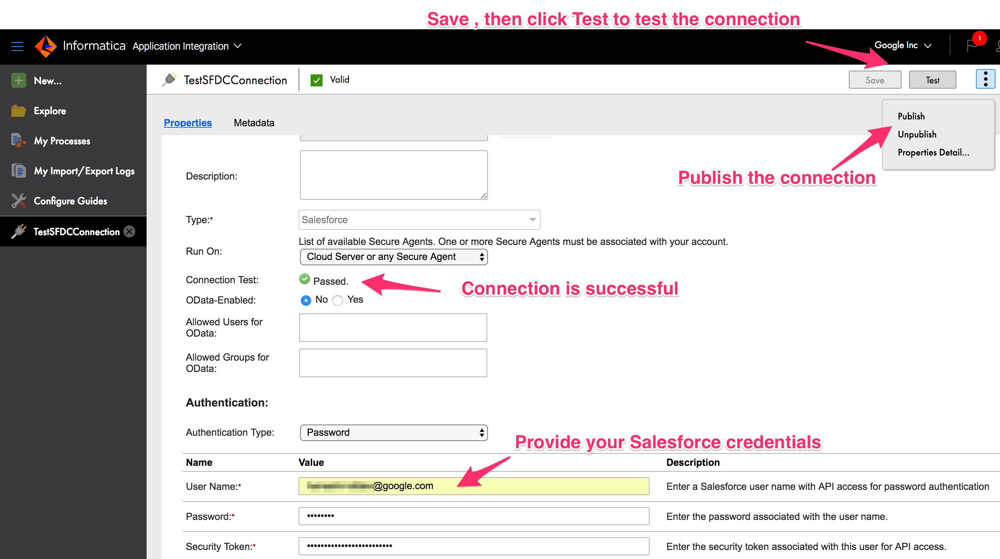

12. Publish and Test the *FetchLeads* workflow

* Click on the *FetchLeads* process in the Demo project, then click the 3 dots to Publish the workflow.
* From the same 3 dots menu, click on *Properties Detail*
* Click on the *COPY* button to copy the service url endpoint to the FetchLeads service

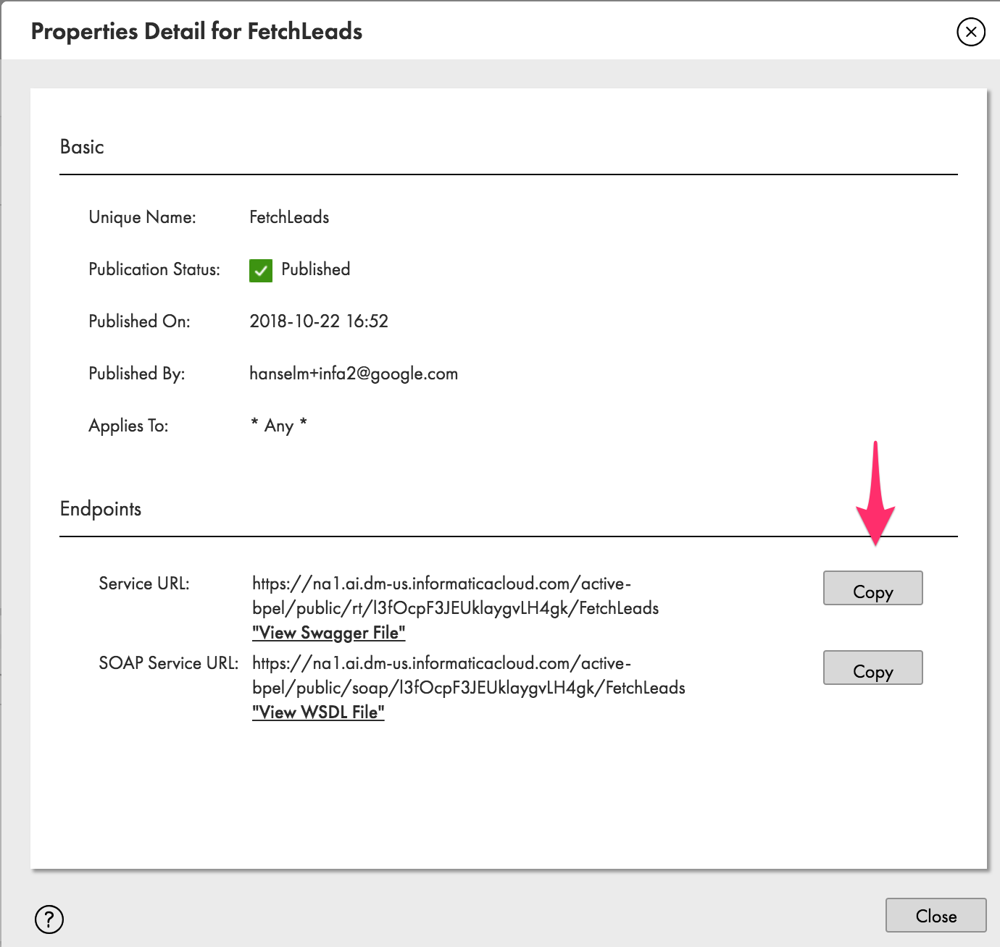

* Paste the service url into a new browser tab and hit Enter
* You should see the output of the workflow that contains a list of Leads retrieved from Salesforce
* This verifies that the *FetchLeads* service is properly configured and operational in IIC

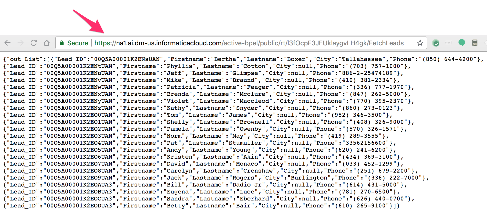

# Summary

That completes the setup on Informatica Integration CLoud. You can now proceed with Lab 1 in this series.

